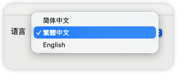
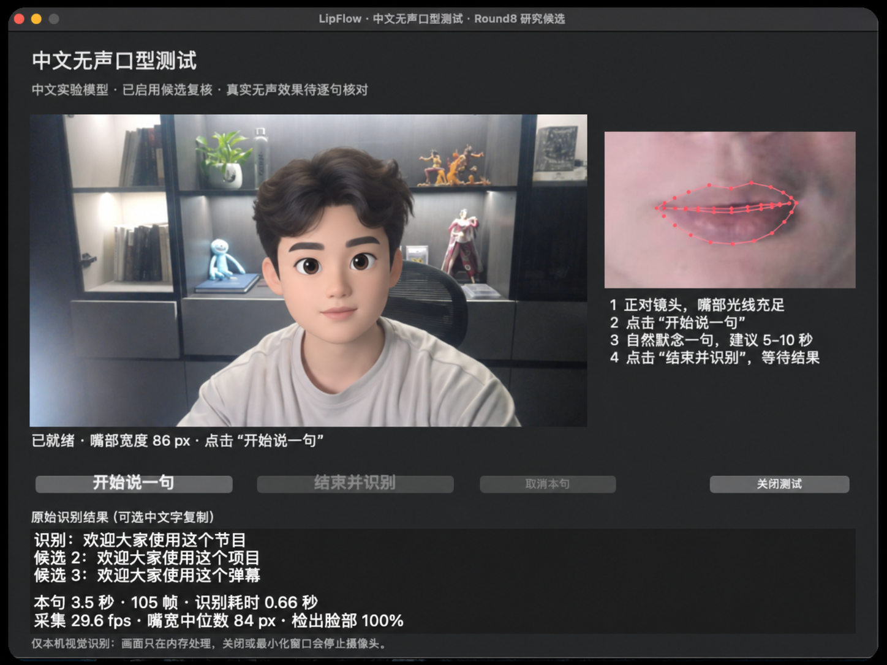

# LipCN · 本地语音与唇语输入

**支持简体中文、繁體中文和 English，默认简体中文。** 在本机把中文语音或中英文口型转换成文字，再从三个表达方案中选择。由 [BryceYuuu](https://github.com/BryceYuuu) 开发与维护。

**Supports Simplified Chinese, Traditional Chinese and English, with Simplified Chinese selected by default.** Turn Mandarin speech or Mandarin/English lip movements into text on your Mac, then choose from three wording options. Developed and maintained by [BryceYuuu](https://github.com/BryceYuuu).

LipCN 专注于中文输入，并集成原项目的英文口型识别。体验完整的原版英文应用，欢迎使用原作者 [Amy Zhou（@amywork777）](https://github.com/amywork777) 的 [Lipflow 项目](https://github.com/amywork777/lipflow)。

LipCN focuses on Mandarin input and also integrates the original English lip-reading model. For the full original English application, check out [Lipflow](https://github.com/amywork777/lipflow) by [Amy Zhou (@amywork777)](https://github.com/amywork777).

## 功能 / Features

| 中文 | English |
| --- | --- |
| **三种语言**：默认简体中文；繁體中文共用中文识别模型，结果、复制与输入均输出繁体；English 使用原项目的英文口型模型，仅采集画面。 | **Three language choices:** Simplified Chinese by default; Traditional Chinese uses the same Mandarin recognizer with traditional output for display, copy and insertion; English uses the original visual model with camera-only capture. |
| **中文语音优先，口型回退**：有可靠语音时使用本地 Whisper；无声或语音可信度不足时，尝试中文口型识别。 | **Mandarin speech first, lip-reading fallback:** local Whisper handles accepted speech; silent or low-confidence audio falls back to the Mandarin visual model. |
| **三个表达方案**：结果区仅显示“方案一、方案二、方案三”；选择后复制或输入原应用。 | **Three wording options:** a minimal result area shows Option 1, 2 and 3; copy or insert the option you choose. |
| **本地文字整理**：补标点、整理表达，并检查数字、时间、否定等改动；无法可靠改写时保留原文，允许方案重复。 | **Local wording cleanup:** punctuation and phrasing with checks on numbers, time references, negation and other changes; uncertain edits keep the original wording, so options may repeat. |
| **右 Command 切换**：按一下开始、再按一下结束；Esc 取消，也可使用窗口按钮。 | **Right Command toggle:** press once to start and again to finish; Esc cancels, with on-screen buttons available too. |
| **摄像头与嘴部预览**：查看脸部画面和嘴部跟踪；录制最长 20 秒，结束时保留短暂句尾。 | **Camera and mouth preview:** see the camera feed and mouth tracking; recordings are capped at 20 seconds with a short ending buffer. |
| **本机处理**：中文桌面入口不上传录音、画面或识别文字，不保存句子历史，也不读取焦点输入框内容。 | **On-device processing:** the Mandarin desktop entry does not upload audio, frames or recognized text, store sentence history, or read text from the focused field. |
| **分阶段启动与安全退出**：语音就绪后即可开始；其余模型继续准备。加载、识别和资源释放使用同一工作线程。 | **Staged startup and orderly shutdown:** start recording once speech is ready while other models continue loading; one worker owns loading, inference and cleanup. |

上述功能对应当前 **LipCN 2.2.0**（`desktop/mandarin/`），面向 **Apple Silicon Mac、macOS 14+、Python 3.11–3.12**。中文口型识别仍处于实验阶段，真实无声表达需要逐句核对。

These features describe **LipCN 2.2.0** (`desktop/mandarin/`) for **Apple Silicon Macs, macOS 14+, and Python 3.11–3.12**. Mandarin lip reading remains experimental; review each result, especially for silently mouthed speech.

## 界面 / Preview



*三种语言可选，默认简体中文；简繁共用中文识别，English 使用英文口型模型。*

*Three language choices, with Simplified Chinese as the default. Both Chinese writing systems share the Mandarin recognizer; English uses the English visual model.*



*上图为早期中文纯口型测试界面；当前版本已加入语音优先，并将结果区精简为三个方案。截图中的单句耗时不代表通用性能。*

*The image shows an earlier Mandarin lip-only prototype. The current version adds speech-first recognition and a simpler three-option result area. The timing shown in the screenshot is not a general performance benchmark.*

## 开始使用 / Getting started

```bash
git clone https://github.com/BryceYuuu/LipCN.git
cd LipCN
```

按照 **[中文桌面运行说明 / Mandarin desktop setup](desktop/mandarin/README.md)** 安装依赖、准备模型并启动。此仓库发布源代码与测试；大型模型、研究适配权重和数据集需要单独准备，不包含可直接分发的完整安装包。

Follow **[Mandarin desktop setup](desktop/mandarin/README.md)** to install dependencies, prepare models and launch the app. This repository contains source code and tests. Large models, research adapters and datasets must be obtained separately; this is not a self-contained application installer.

1. 准备好模型并允许摄像头、麦克风权限。 / Prepare models and allow camera and microphone access.
2. 选择“简体中文”“繁體中文”或“English”，待模型就绪后点击“开始说一句”，也可使用已授权的右 Command。 / Choose Simplified Chinese, Traditional Chinese or English; once ready, click Start or use an authorized Right Command hotkey.
3. 说话或自然默念，结束后核对三个方案。 / Speak or mouth your sentence, then review the three options.
4. 选择复制或输入；输入原应用还需要辅助功能权限。 / Choose Copy or Insert; insertion into the original app also requires Accessibility permission.

只在主动开始后采集。结束、取消、隐藏、最小化或关闭会停止采集。模型仍在后台准备时，第一句识别可能需要等待初始化完成。

Capture begins only after an explicit start. Finishing, cancelling, hiding, minimizing or closing stops capture. If background initialization is still running, the first recognition may wait for it to finish.

每次打开默认简体中文。简繁切换即时生效；中英文切换需要加载对应模型。加载、录制或识别过程中暂不可切换语言。English 识别英文口型，不调用语音识别或翻译。

Each launch defaults to Simplified Chinese. Switching Chinese writing systems is immediate; switching between Mandarin and English loads the corresponding model. Language selection is disabled while loading, recording or recognizing. English reads English lip movements without speech recognition or translation.

## 项目结构 / Project layout

| 路径 / Path | 说明 / Description |
| --- | --- |
| [`desktop/mandarin/`](desktop/mandarin/) | 当前中文语音与唇语桌面入口 / Current Mandarin speech-and-lip desktop entry |
| [`lipflow/`](lipflow/) | 共享组件与保留的原有运行入口 / Shared components and retained legacy runtime |
| [`research/`](research/README.md) | 独立的中文训练、评测与研究报告 / Mandarin training, evaluation and research reports |
| [`tests/`](tests/), [`desktop/mandarin/tests/`](desktop/mandarin/tests/) | 核心及中文桌面回归测试 / Core and Mandarin desktop regression tests |
| [旧版英文说明](README.legacy.md) · [旧版中文说明](README.legacy.zh-CN.md) | 原有跨平台入口与设置，其行为和隐私选项与当前中文窗口不同 / Legacy cross-platform entry points with their own behavior and privacy settings |

## 性能与验证 / Performance and validation

本机开发测试中，四条 8.6–14.3 秒的公开中文音频，在三个模型驻留且完成预热后，从识别到三个方案平均约 **5.48 秒**（4.88–5.80 秒）。本次启动修复的三次测试中，开始按钮在模型初始化开始后约 **4.1–6.2 秒**可用；其余模型继续加载。这些是特定 Mac 上的小样本结果，并非速度或准确率保证。

In local development testing, four public Mandarin clips lasting 8.6–14.3 seconds took an average of **5.48 seconds** from recognition to three options after all models were resident and warmed up (4.88–5.80 seconds). In three startup checks, recording became available about **4.1–6.2 seconds** after model initialization began, while the remaining models continued loading. These small-sample results on one Mac are not speed or accuracy guarantees.

当前发布代码全仓测试为 **1136 项通过、24 项跳过**（平台或可选硬件/模型相关），覆盖语言切换、英文路由、简繁输出与内容保护。另用原项目的公开视频片段验证英文口型：模型加载与预热约 **3.17 秒**，7.7 秒片段的视觉编码与三个候选解码合计约 **1.95 秒**，不包含视频预处理和文字整理。自动测试与单个样例不能代替真实麦克风、摄像头、全局快捷键、跨应用输入和准确率验证。

The release source passed **1,136 tests, with 24 skipped** for platform-specific or optional hardware/model checks, covering language switching, English routing, Chinese script output and content guards. An offline check using the original project's public sample took about **3.17 seconds** to load and warm the English model and **1.95 seconds** to encode a 7.7-second clip and decode three candidates, excluding video preprocessing and wording cleanup. Automated tests and one sample do not replace real microphone, camera, global-hotkey, cross-app insertion or accuracy checks.

## 许可 / License

项目代码保留 [MIT License](LICENSE) 与原作者版权声明。第三方组件、模型和数据适用各自许可，详见 [NOTICE](NOTICE)。CNVSRC/CMLR 等研究权重的使用限制不会因为本仓库代码采用 MIT 而改变；此仓库不重新分发这些权重、适配参数或数据集。

The project code retains its [MIT License](LICENSE) and original copyright notice. Third-party components, models and datasets retain their own terms; see [NOTICE](NOTICE). The MIT code license does not remove the restrictions on research weights such as CNVSRC/CMLR. Those weights, adapters and datasets are not redistributed here.

## 致谢 / Acknowledgements

感谢 **[Amy Zhou](https://github.com/amywork777)** 创建并开源 **[Lipflow](https://github.com/amywork777/lipflow)**，让这个项目有了起点。也感谢原项目所依赖的研究者与开源贡献者。本仓库在原作基础上独立维护，继续探索中文语音与唇语输入。

Thank you to **[Amy Zhou](https://github.com/amywork777)** for creating and open-sourcing **[Lipflow](https://github.com/amywork777/lipflow)**, the foundation of this project. Thanks also to the researchers and open-source contributors behind its components. This repository is maintained independently and continues exploring Mandarin speech and lip-based input.
